# Munib Tracker: Return to Allah in Repentance — Free Salah, Zikr & Qaza Companion (Open Source)

<!-- MEDIUM IMAGE: upload docs/article_imgs/21-hero-return-to-allah.png -->

*The journey of Munib: turning back to Allah, again and again.*

**Munib (مُنيب)** means one who turns back to Allah — returning in repentance, again and again.

That’s the heart of this app. Munib Tracker isn’t a content dump with a crescent icon. It’s a **tracker and reminder** for the journey back to Allah: honest salah logging, qaza you can actually clear, daily zikr, gentle reminders, and a place to renew tawbah — all offline-first and free.

Tagline: *Track Your Journey Back to Allah.*

I built it as a calm companion for that return, then open-sourced the full monorepo so the ummah can use it, inspect it, and help improve it.

<!-- MEDIUM IMAGE: upload docs/article_imgs/00-logo.png -->

*Munib (مُنيب) Tracker — the app mark.*

---

## Quick summary

- **Munib** = the one who returns to Allah in repentance; the app is built around that meaning
- A free **tracker and reminder** for salah, qaza, zikr, and daily tawbah — not guilt, not shame
- Offline-first Qur’an, hadith, learning, and worship guides beside the trackers
- One product on **iPhone, Android, tablets, web/PWA, Apple TV, and Android TV / Fire TV**
- Widgets, Live Activities, Watch, Wear, Siri, and Google Assistant so reminders meet you where you are
- **Guest mode** — no account required; optional cloud sync later
- No ads and no paywall on the core journey back to Allah
- Religious text from **open datasets** — not AI-generated scripture
- Full monorepo public under **PolyForm Noncommercial 1.0.0**

---

## Table of contents

1. [What does Munib mean?](#what-does-munib-mean)
2. [What is Munib Tracker?](#what-is-munib-tracker)
3. [How tracking and reminders support your return](#how-tracking-and-reminders-support-your-return)
4. [Core features](#core-features-of-munib-tracker)
5. [Supported platforms](#supported-platforms-and-companion-apps)
6. [How the codebase is organized](#how-the-codebase-is-organized)
7. [Open source and license](#open-source-and-license)
8. [Download and links](#download-and-links)
9. [FAQ](#faq)

---

## What does Munib mean?

In Arabic, **Munib (مُنيب)** points to someone who turns back — who returns to Allah in repentance.

Every Muslim knows that return isn’t a one-time event. You slip. You miss a prayer. You go quiet on dhikr. Then you turn again. Munib Tracker exists for that cycle: a practical tool so “returning” isn’t only a feeling — it’s something you can **track**, **remember**, and **rebuild** day by day.

The name isn’t decoration. It’s the product thesis.

---

## What is Munib Tracker?

Munib Tracker is a free, offline-first **worship companion** for people walking back to Allah.

<!-- MEDIUM IMAGE: upload docs/article_imgs/01-home-store.png -->
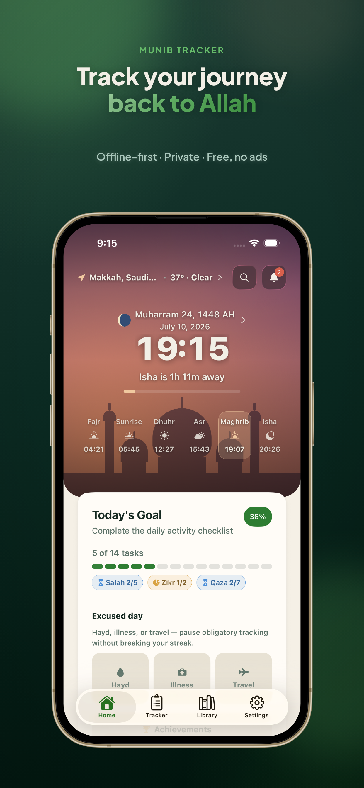

*Home: prayer times, today’s goals, and an honest start to the day.*

You use it to:

- Mark salah honestly (completed, missed, delayed, or qaza)
- Clear what was missed at a pace you can keep
- Stay with adhkar and a free tasbeeh
- Renew **today’s repentance** — tap when you’ve made tawbah
- Read Qur’an and hadith **offline**
- Learn fiqh and seerah through structured, cited lessons

Encouragement stays gentle. The calendar stays honest. Progress lives on your device first. Start as a guest; create an account later only if you want optional cloud sync.

### Where to open it

| Surface | Link |
|---------|------|
| Marketing site | [munibtracker.app](https://munibtracker.app) |
| Web app (PWA) | [my.munibtracker.app](https://my.munibtracker.app) |
| iOS | [App Store — Munib Tracker](https://apps.apple.com/app/id6787222180) |
| Android | [Google Play — Munib Tracker](https://play.google.com/store/apps/details?id=app.munibtracker) |

---

## How tracking and reminders support your return

Returning to Allah needs sincerity. Tools don’t replace that — they support it.

Munib Tracker pairs **tracking** with **reminders** so the journey doesn’t fade when life gets loud:

| Need | How Munib helps |
|------|-----------------|
| Show up for salah | Log each prayer; see streaks and an honest calendar; optional adhan and prayer reminders |
| Make up what you missed | Qaza counters, pace planner, and debt dashboard so backlog becomes doable |
| Remember Allah daily | Adhkar library, tasbeeh, zikr goals, bedtime-aware reminders |
| Renew repentance | “Today’s Repentance” — tap when you’ve renewed tawbah |
| Stay oriented | Prayer times, Hijri date, qibla, widgets, Live Activities, Watch / Wear |
| Keep learning while you return | Qur’an, hadith, cited lessons, and worship guides |

<!-- MEDIUM IMAGE: upload docs/article_imgs/09-tracker-native.png -->
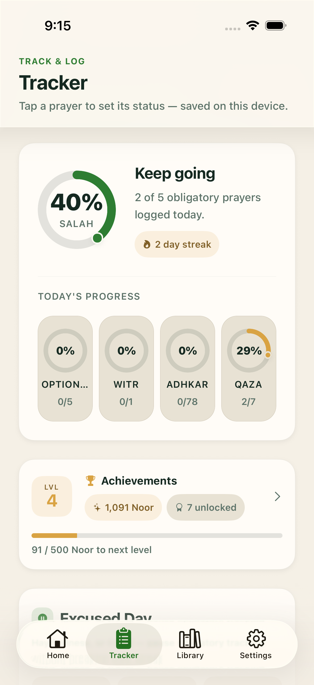

*The tracker: an honest record of your prayers — not a scoreboard of shame.*

Reminders for salah, zikr, and qaza are **opt-in**. Nothing nags by default. You choose what the app should gently pull you back toward.

---

## Core features of Munib Tracker

Each pillar below serves the same purpose: help you return — and keep returning — with clarity instead of overwhelm.

### Salah tracking

Log each prayer as completed, missed, delayed, or qaza — with streaks, notes, and a calendar that stays honest.

<!-- MEDIUM IMAGE: upload docs/article_imgs/02-salah-store.png -->
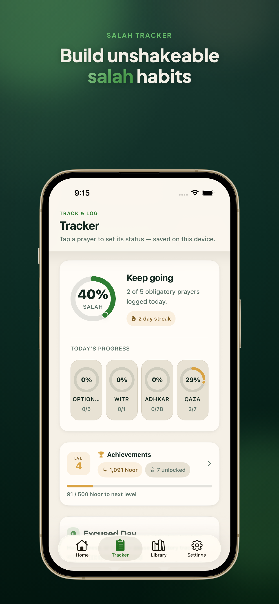

*Salah on your journey — completed, missed, delayed, or qaza.*

- Five fard prayers, plus Witr and sunnah categories
- Progress ring, streaks, and gentle encouragement (never shame)
- Calendar for prayed, partial, and missed days
- Prayer-times hero with Hijri date, moon phase, and countdown
- Calculation method and Asr madhab
- Ramadan mode, travel (qasr/jam’), illness, and hayd/excused modes
- Opt-in adhan and reminders

### Qaza (make up what was missed)

Returning often means facing what was left behind. Munib Tracker turns qaza into a plan you can finish.

<!-- MEDIUM IMAGE: upload docs/article_imgs/03-qaza-store.png -->
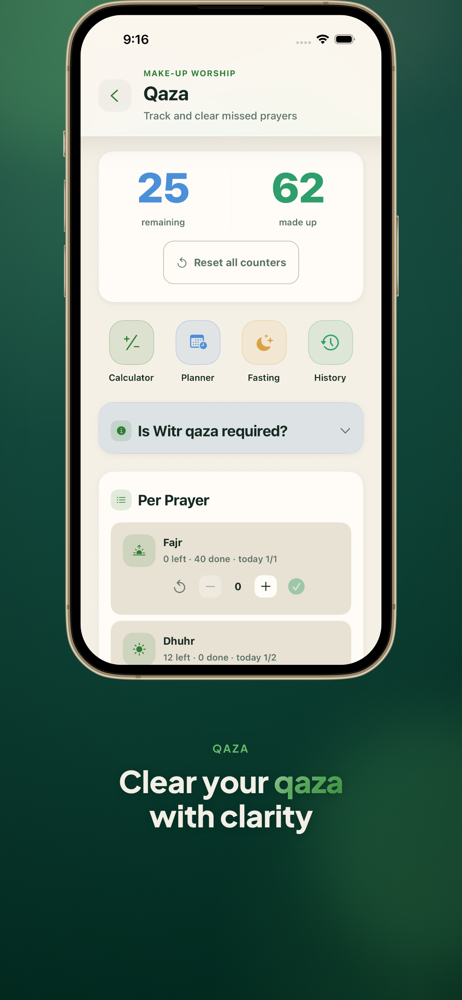

*Qaza: estimate, pace, and clear what was missed.*

- Per-prayer counters synced from missed tracker entries
- Lifetime calculator (with scholar disclaimer)
- Daily pace planner with an ETA to clear your backlog
- Missed fast tracking and estimates
- History, smart planner, and a unified debt dashboard

### Zikr and adhkar

Morning, evening, and situational adhkar — plus a counter that feels good to tap.

<!-- MEDIUM IMAGE: upload docs/article_imgs/08-tasbeeh-native.png -->
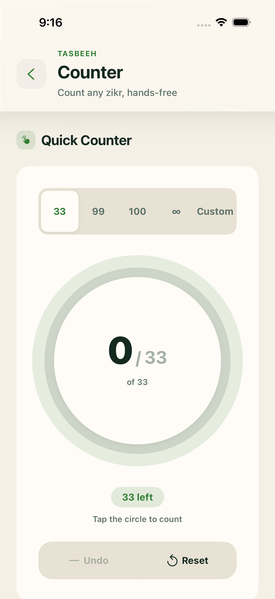

*Free tasbeeh — remember Allah with a simple, tactile counter.*

<!-- MEDIUM IMAGE (optional): upload docs/article_imgs/10-zikr-native.png -->
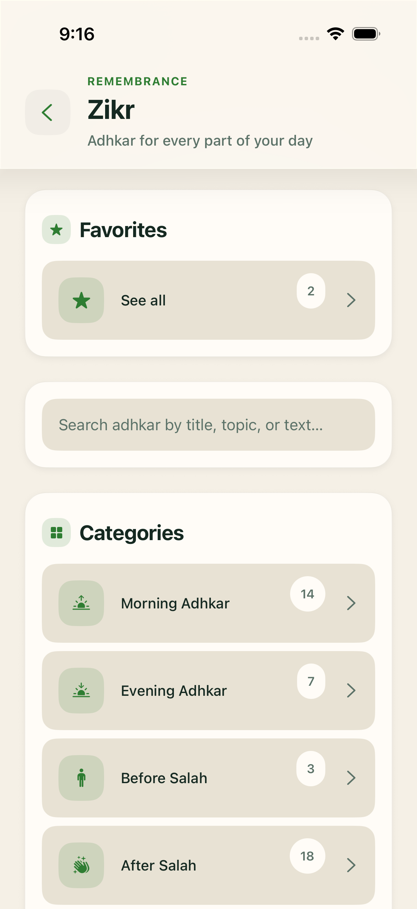

*Adhkar library: morning, evening, and situational remembrance.*

- 54 adhkar across categories; favorites you can reorder
- Custom adhkar builder with speech-to-text
- Free tasbeeh and zikr-linked daily goals
- Bedtime-aware before-sleep reminders

### Today’s repentance

The app includes a simple daily repentance check-in: renew tawbah and tap when you have repented today. It keeps the meaning of Munib visible in the daily habit — not only in the name.

### Offline Qur’an, hadith, and duas

Read, search, and listen without needing the network for the core library.

<!-- MEDIUM IMAGE: upload docs/article_imgs/04-library-store.png -->
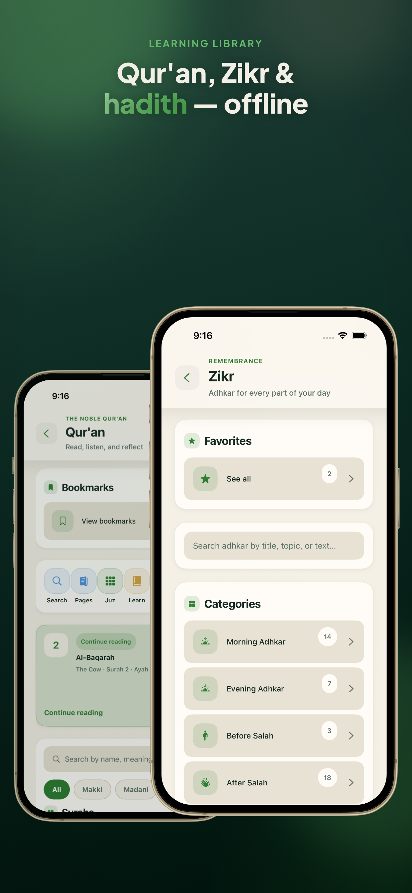

*Library: Qur’an, hadith, duas, and more — offline when you need them.*

<!-- MEDIUM IMAGE (optional): upload docs/article_imgs/06-names-store.png -->
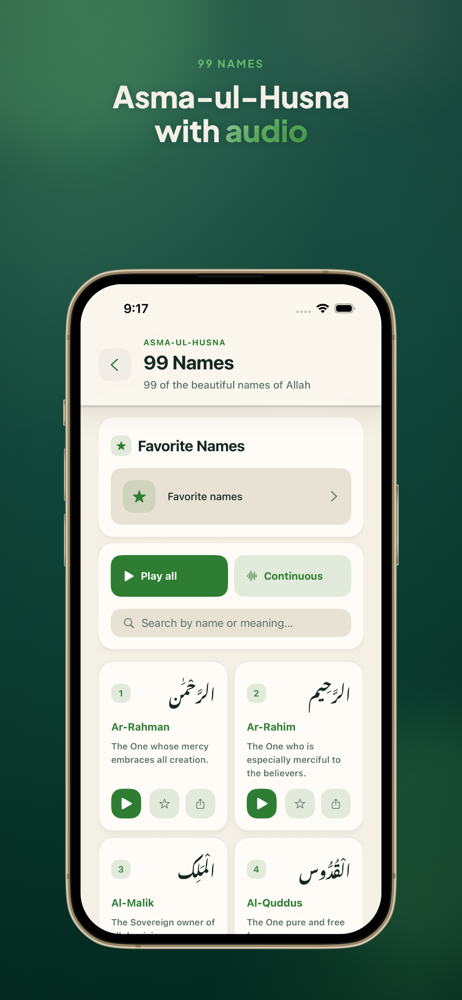

*The 99 Names — learn, reflect, and return.*

- Full mushaf: surah, juz, 604-page view, word-by-word, tajweed coloring
- Translations (two bundled; more on demand), tafsir on demand, multiple reciters
- Bundled Nawawi 40 and Riyad as-Salihin; major collections on demand
- 270 duas, duroods, and the 99 Names of Allah
- Universal fuzzy search across content sources

### Learn your deen

Structured lessons with progress, quizzes, and citations — including hope, mercy, and the path of repentance where the topics call for it.

- Aqeedah, prophets, seerah, battles, Sahaba, early history
- Jannah, Jahannam, and the Last Day — with interactive quizzes
- New-Muslim guide, learn-dua path, Friday / Laylat al-Qadr / Eid / ruqyah topics
- Islamic finance education and related guides

### Qur’an learning path

Go from Arabic letters to tajweed, memorization, and reflection. One tap opens the full mushaf when you want to keep reading.

### Worship guides

Practical fiqh with checklists and calculators:

- Salah and taharah guides
- Zakat calculator
- Hajj & Umrah learn guide with rite checklists
- Travel, illness, and hayd — worship at your capacity
- Ramadan tracker, tahajjud log, khushu’ journal

### Prayer times and qibla

<!-- MEDIUM IMAGE: upload docs/article_imgs/05-qibla-store.png -->
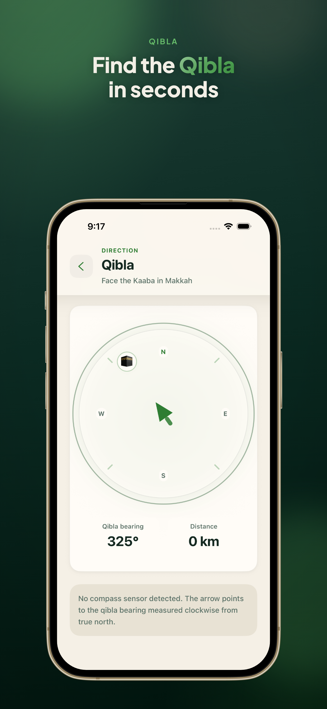

*Know when to pray and which way to face.*

- GPS or city search; multiple calculation methods and Asr madhab
- Hijri events, moon phase, optional weather
- Qibla compass with alignment feedback on native

### Progress and insights

Week, month, and year charts. Weekly worship reports. Achievement tracks. Growing “Noor” devotion levels. Optional reminders for prayer, zikr, qaza, daily content, and Friday.

### Personalization and languages

Light, dark, or system theme. Accent presets and custom colors. **23 locales**, including RTL for Arabic, Urdu, Persian, Pashto, and Kurdish. Scripture language and UI language can stay separate when that matters.

<!-- MEDIUM IMAGE (optional light/dark pair): upload docs/article_imgs/15-marketing-home-light.png and 16-marketing-home-dark.png -->
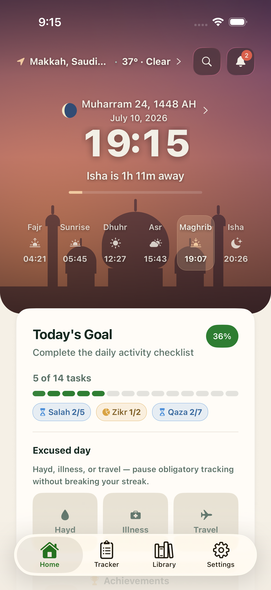

*Light theme home (optional companion to dark).*

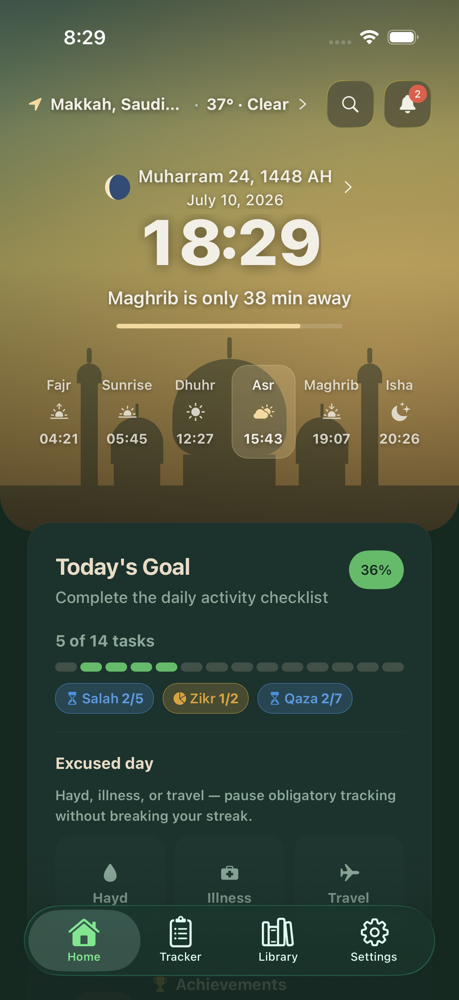

*Dark theme home — same journey, your preference.*

---

## Supported platforms and companion apps

Munib Tracker is one Expo codebase — so the same journey back to Allah can meet you on the phone, the TV, the watch, or the lock screen.

<!-- MEDIUM IMAGE: upload docs/article_imgs/22-platforms-family.png -->
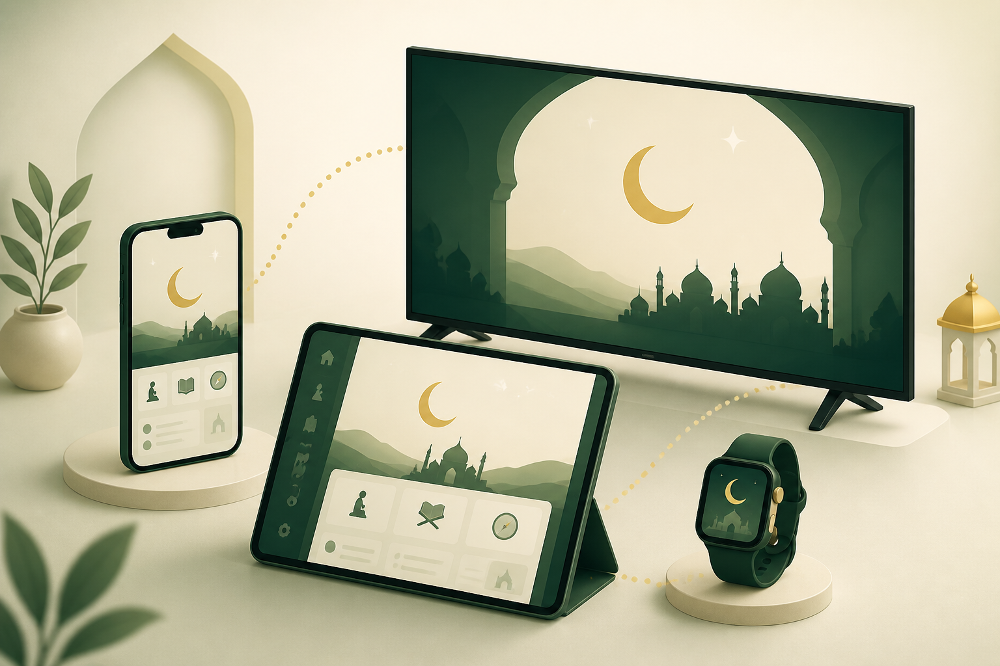

*One product family: phone, tablet, TV, and watch.*

### Full app

| Platform | Supported |
|----------|-----------|
| iPhone and Android phones | Yes |
| iPad and Android tablets (adaptive layouts) | Yes |
| Web / PWA | Yes |
| Apple TV (tvOS) | Yes |
| Android TV / Fire TV | Yes |

<!-- MEDIUM IMAGE: upload docs/article_imgs/13-apple-tv-home.png -->
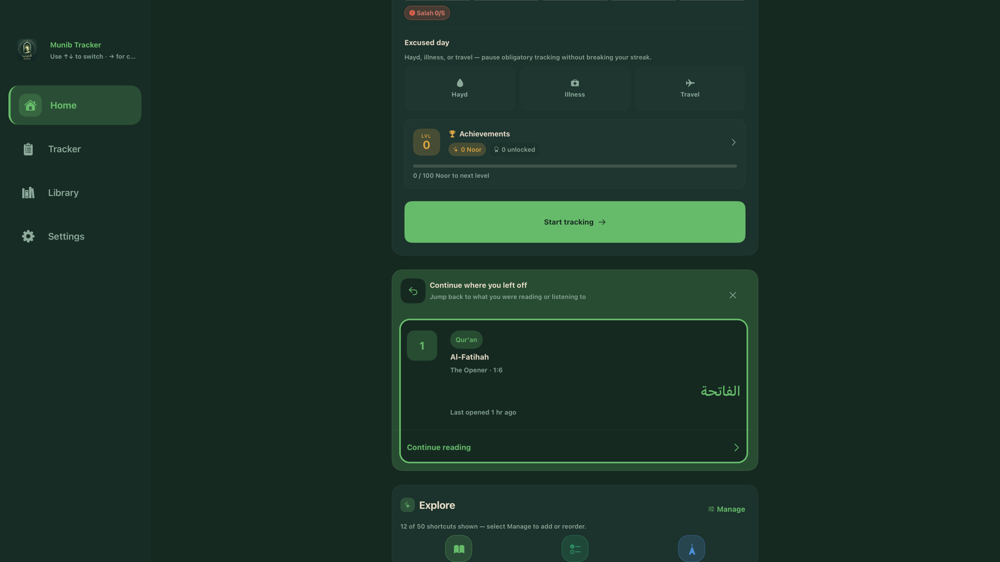

*Apple TV — worship tracking on the big screen.*

<!-- MEDIUM IMAGE: upload docs/article_imgs/20-android-tv-home.png -->
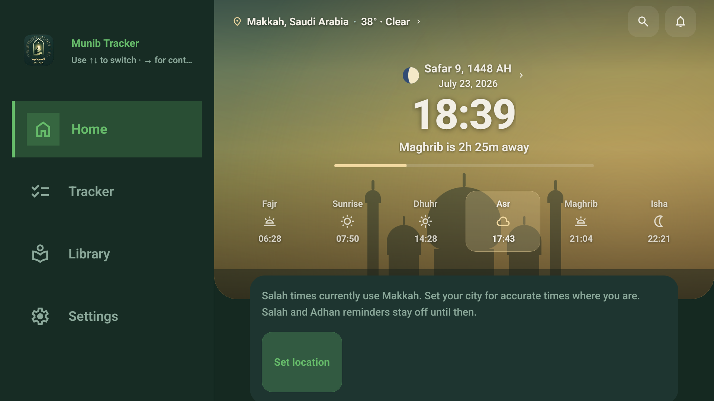

*Android TV / Fire TV — same companion, leanback layout.*

### Companion surfaces

These ship with native builds (not Expo Go):

- Home and lock-screen widgets (next prayer, schedule, progress, tasbeeh, and more)
- iOS Live Activities (lock screen / Dynamic Island)
- Siri Shortcuts and Google Assistant / App Actions (for example, mark salah)
- Apple Watch app and complications
- Wear OS tile

<!-- MEDIUM IMAGE: upload docs/article_imgs/11-widget-next-prayer.png -->
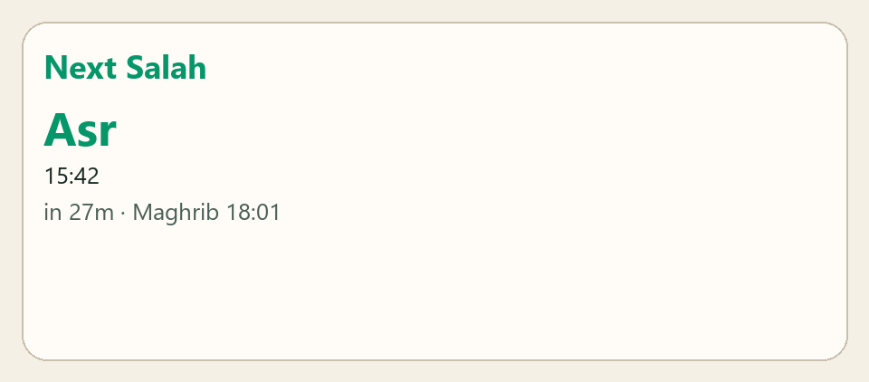

*Next prayer widget — a glance toward the next return.*

<!-- MEDIUM IMAGE: upload docs/article_imgs/17-widget-qaza.png -->
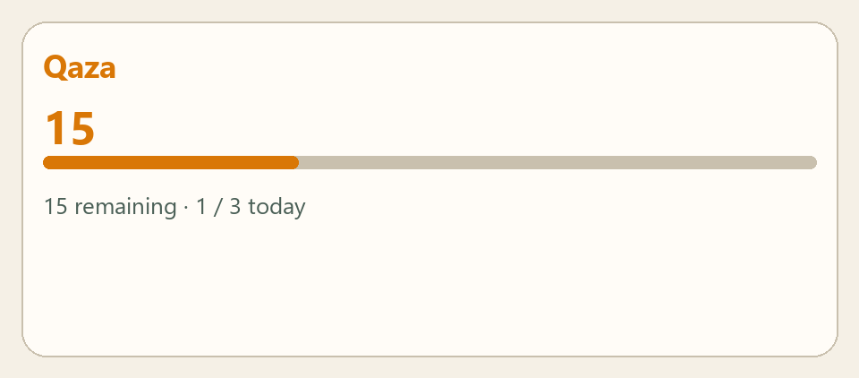

*Qaza debt widget — keep the backlog visible, not forgotten.*

<!-- MEDIUM IMAGE: upload docs/article_imgs/18-widget-tasbeeh.png -->
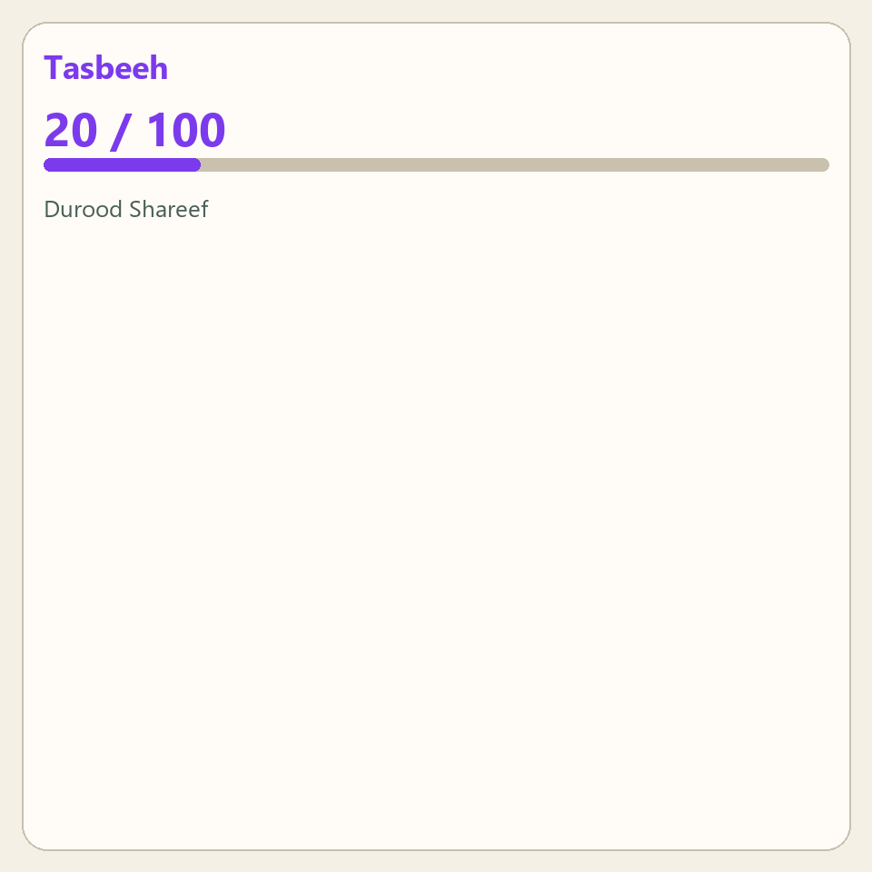

*Tasbeeh glance — dhikr from the home screen.*

<!-- MEDIUM IMAGE: upload docs/article_imgs/12-watch-schedule.png -->
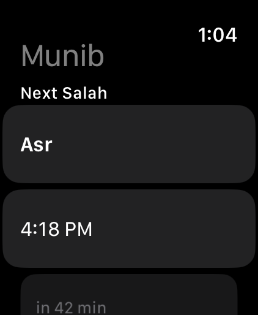

*Apple Watch schedule — mark salah from your wrist.*

On desktop, use the web app. visionOS and native desktop shells are out of scope on purpose.

---

## How the codebase is organized

Curious developers: Munib Tracker is a **pnpm + Turborepo** monorepo built for worship tracking and a large offline content library.

| Piece | Stack / role |
|-------|----------------|
| Product app | Expo SDK 57 — iOS, Android, web, TV |
| Marketing | Next.js 16 + Tailwind |
| API | NestJS 11 — auth + cloud sync, OpenAPI → typed client |
| Admin | Next.js ops console (users, reports, broadcasts) |
| Shared packages | Domain types, theme, API contract/client, Live Activity & surface push delivery, store screenshot specs |

Data stays offline-first on the device (AsyncStorage repositories and stores). Content is built from open datasets into bundled assets with a credits registry. Generated scripture files aren’t hand-edited, and religious text isn’t AI-authored.

Maintainer map: [repo README](https://github.com/mubbi/munib-tracker) and [`docs/`](https://github.com/mubbi/munib-tracker/tree/main/docs).

---

## Open source and license

I didn’t only ship store binaries. The **full monorepo** is public: product app, API, marketing site, admin console, and shared packages.

**Repository:** [github.com/mubbi/munib-tracker](https://github.com/mubbi/munib-tracker)

### Why release the source?

A tool for returning to Allah should be inspectable. You should be able to run a local build, learn from the architecture, fix bugs, improve translations, and see where religious content comes from — not trust a black box.

### License in plain language

Munib Tracker is **source-available under [PolyForm Noncommercial 1.0.0](https://polyformproject.org/licenses/noncommercial/1.0.0)**.

| You may | You may not |
|---------|-------------|
| Use, modify, and redistribute for personal, educational, religious, charitable, and other **non-commercial** purposes | Sell the software, sell customized versions, or use it commercially without a separate license |

Keep `LICENSE` and `NOTICE`, and credit Munib Tracker with a link to [munibtracker.app](https://munibtracker.app).

That’s intentional: free for the ummah and for learning — not free for someone else to productize and sell.

### How to contribute

Contributions are welcome under the same license. See [CONTRIBUTING.md](https://github.com/mubbi/munib-tracker/blob/main/CONTRIBUTING.md) for setup, Conventional Commits (`pnpm commit`), and PR expectations.

### No sponsorship

Munib Tracker does **not** accept sponsorship, funding, or donations. Don’t send money to anyone claiming to collect on its behalf. See the repo `NOTICE` and `SUPPORT.md`.

---

## Download and links

<!-- MEDIUM IMAGE: upload docs/article_imgs/14-android-feature-graphic.png -->
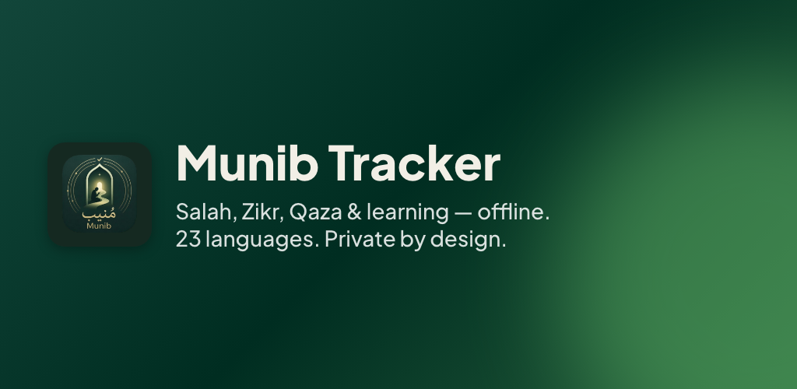

*Find Munib Tracker on the App Store and Google Play.*

- Marketing: [munibtracker.app](https://munibtracker.app)
- Web app: [my.munibtracker.app](https://my.munibtracker.app)
- App Store: [Munib Tracker](https://apps.apple.com/app/id6787222180)
- Google Play: [Munib Tracker](https://play.google.com/store/apps/details?id=app.munibtracker)
- Source: [github.com/mubbi/munib-tracker](https://github.com/mubbi/munib-tracker)
- Content credits: [munibtracker.app/credits](https://munibtracker.app/credits)
- Author: [Mubbasher Ahmed](https://mubbi.me) · [Medium @mubbiqureshi](https://medium.com/@mubbiqureshi)

If this helped, share it with someone who’s trying to return — or open an issue or PR on GitHub.

---

## FAQ

### What does Munib mean?

**Munib (مُنيب)** refers to one who turns back to Allah — returning in repentance. The app is named for that meaning: a tracker and reminder for the journey back to Allah.

### What is Munib Tracker?

A free, offline-first companion for salah, zikr, qaza, daily tawbah, Qur’an, hadith, learning, and worship guides. Tagline: *Track Your Journey Back to Allah.*

### Is Munib Tracker free?

Yes. The core product is free. There’s no ads-based monetization and no premium paywall on the worship journey described above.

### Is Munib Tracker open source?

The full monorepo is public and **source-available under PolyForm Noncommercial 1.0.0**. You can use, study, modify, and redistribute for non-commercial purposes. Commercial sale or commercial customization needs a separate license. See `LICENSE`, `NOTICE`, and [docs/OPEN_SOURCE.md](./OPEN_SOURCE.md).

### Which platforms does Munib Tracker support?

iOS and Android phones and tablets, web/PWA, Apple TV, Android TV / Fire TV, plus widgets, Live Activities, Apple Watch, Wear OS, Siri, and Google Assistant.

### Was religious content written by AI?

No. Qur’an, hadith, adhkar, duas, names, and related scripture-facing content come from open datasets through a documented pipeline. UI copy can be localized with tooling; scripture is not AI-authored.

### Do I need an account to use Munib Tracker?

No. Guest mode works offline-first. Sign in only if you want optional cloud sync and account features.

### How can I contribute?

Clone [github.com/mubbi/munib-tracker](https://github.com/mubbi/munib-tracker), read [CONTRIBUTING.md](https://github.com/mubbi/munib-tracker/blob/main/CONTRIBUTING.md), and open a PR. Translations, bug fixes, docs, and careful content-pipeline improvements are especially useful.

### Does Munib Tracker accept donations?

No. The project does not accept sponsorship, funding, or donations.

---

## Medium image checklist

Upload from [`docs/article_imgs/`](./article_imgs/) (see also [`article_imgs/README.md`](./article_imgs/README.md)):

| Order | File | Section |
|------:|------|---------|
| 1 | `21-hero-return-to-allah.png` | Opening hero |
| 2 | `00-logo.png` | Intro / brand |
| 3 | `01-home-store.png` | What is Munib Tracker |
| 4 | `09-tracker-native.png` | Tracking & reminders |
| 5 | `02-salah-store.png` | Salah |
| 6 | `03-qaza-store.png` | Qaza |
| 7 | `08-tasbeeh-native.png` | Zikr |
| 8 | `10-zikr-native.png` | Adhkar (optional) |
| 9 | `04-library-store.png` | Library |
| 10 | `06-names-store.png` | Names (optional) |
| 11 | `05-qibla-store.png` | Qibla |
| 12 | `15` / `16` marketing homes | Themes (optional) |
| 13 | `22-platforms-family.png` | Platforms |
| 14 | `13-apple-tv-home.png` | Apple TV |
| 15 | `20-android-tv-home.png` | Android TV |
| 16 | `11` / `17` / `18` widgets | Companion surfaces |
| 17 | `12-watch-schedule.png` | Apple Watch |
| 18 | `14-android-feature-graphic.png` | Download |

Spare / alternate shots: `07-home-native.png`, `19-tvos-home-native.png`.
