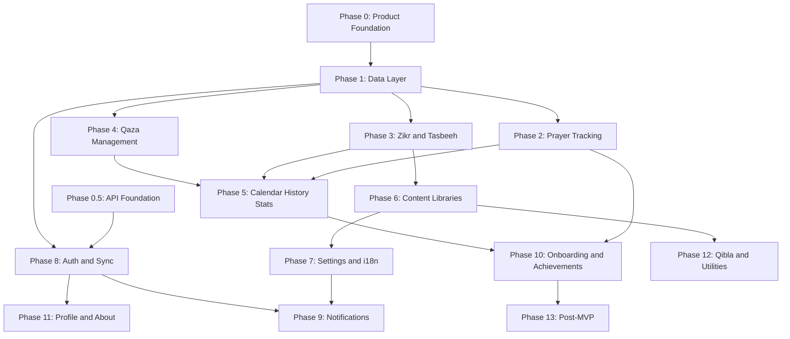

# Munib Tracker — Phased Product Requirements (PRD)

> **Purpose:** Executable roadmap for building Munib Tracker. Each phase has ordered tasks with file paths, types, packages, and acceptance criteria so an AI agent (or developer) can implement without guessing.
>
> **Last reviewed:** 2026-07-03  
> **Apps:** `apps/app` (Expo SDK 57) · `apps/marketing-web` (Next.js 16) · `apps/api` (NestJS 11)  
> **Agent guides:** [`AGENTS.md`](../AGENTS.md), [`apps/app/AGENTS.md`](../apps/app/AGENTS.md), [`apps/marketing-web/AGENTS.md`](../apps/marketing-web/AGENTS.md), [`apps/api/AGENTS.md`](../apps/api/AGENTS.md)

---

## Document conventions

| Field | Meaning |
|-------|---------|
| **ID** | Stable task identifier (e.g. `P2.1`). Reference in commits/PRs. |
| **Depends on** | Task IDs that must be done first. |
| **Status** | `done` · `partial` · `todo` (as of last review) |
| **AC** | Acceptance criteria — all must pass before marking complete. |

**Implementation rules (all phases):**

- Use `useTheme()` from `apps/app/src/providers/theme-provider.tsx` — no hardcoded colors.
- Put domain types, constants, and validators in `@munib-tracker/shared`.
- Put design tokens in `@munib-tracker/theme`; app-specific layout in `apps/app/src/constants/theme.ts`.
- Lint/format with Biome; add tests (Jest in `apps/app`, Vitest in `apps/api`, `apps/marketing-web`, and packages).
- Read Expo SDK 57 docs before adding native modules: https://docs.expo.dev/versions/v57.0.0/
- **API:** NestJS modules in `apps/api/src/`; export OpenAPI → `@munib-tracker/api-contract` → Orval SDK in `@munib-tracker/api-client` (`pnpm generate:api`). Read [`.agents/skills/nestjs/SKILL.md`](../.agents/skills/nestjs/SKILL.md) before backend work.
- **Client API usage:** wrap apps with `ApiQueryProvider` from `@munib-tracker/api-client/provider`; prefer generated hooks over hand-rolled fetch.

---

## Monorepo layout

| App / package | Path | Role | Dev command |
|---------------|------|------|-------------|
| **Product** | `apps/app` | Expo SDK 57 — iOS, Android, Web | `pnpm dev:app` |
| **Marketing** | `apps/marketing-web` | Next.js 16 landing site (port 3000) | `pnpm dev:marketing-web` |
| **API** | `apps/api` | NestJS 11 — auth, cloud sync (port 3001) | `pnpm dev:api` |
| `@munib-tracker/shared` | `packages/shared` | Domain types, constants, validators | — |
| `@munib-tracker/theme` | `packages/theme` | Design tokens, `resolveTheme()`, accents | — |
| `@munib-tracker/api-contract` | `packages/api-contract` | OpenAPI spec exported from API | — |
| `@munib-tracker/api-client` | `packages/api-client` | Orval-generated fetch + TanStack Query SDK | — |
| `@munib-tracker/typescript-config` | `packages/typescript-config` | Shared TS configs (incl. `nestjs.json`) | — |
| `@munib-tracker/vitest-config` | `packages/vitest-config` | Vitest presets | — |

**Ports:** marketing-web `3000` · API `3001` · Expo web `~8081` — three separate apps.

---

## Current baseline (already implemented)

### Product app (`apps/app`)

| Area | Status | Key files |
|------|--------|-----------|
| Tab navigation (Home, Tracker, Settings) | `done` | `apps/app/src/app/{index,tracker,settings}.tsx`, `components/app-tabs*.tsx` |
| Theme: light/dark/system + 5 accent presets | `done` | `packages/theme/`, `providers/theme-provider.tsx` |
| Splash + animated overlay | `done` | `apps/app/src/app/_layout.tsx` |
| Reusable UI (StatCard, TrackerRow, SectionHeader) | `done` | `apps/app/src/components/ui/` |
| TanStack Query provider (API client shell) | `partial` | `apps/app/src/providers/api-provider.tsx` — wired; app uses `api/endpoints.ts` for writes |
| Home/Tracker UI driven by real store data | `done` | `(tabs)/index.tsx`, `(tabs)/tracker.tsx` |
| Local DB, stores, auth UI, sync client | `done` | `src/db/`, `src/stores/`, `providers/auth-provider.tsx`, `src/sync/` |

### Marketing site (`apps/marketing-web`)

| Area | Status | Key files |
|------|--------|-----------|
| Landing page (Hero, Features, CTA) | `done` | `src/app/page.tsx`, `src/components/{hero,features,cta-button}.tsx` |
| Layout, metadata, footer | `done` | `src/app/layout.tsx`, `src/components/footer.tsx` |
| `robots.ts` / `sitemap.ts` | `done` | Real domain via `NEXT_PUBLIC_SITE_URL` (`src/lib/site.ts`) |
| TanStack Query provider (API client shell) | `partial` | `src/providers/api-provider.tsx` — wired, unused |
| About, privacy, terms pages | `done` | `src/app/{about,privacy,terms}/page.tsx` |

### API server (`apps/api`)

| Area | Status | Key files |
|------|--------|-----------|
| NestJS 11 scaffold (Webpack + SWC, global prefix `api/v1`) | `done` | `src/main.ts`, `nest-cli.json`, `webpack.config.js` |
| Config + env validation | `done` | `src/config/`, `.env.example` |
| Health probe | `done` | `GET /api/v1/health` — `src/health/` |
| TypeORM database (Postgres prod / SQLite in-memory tests) | `done` | `src/database/` — `UserEntity`, `AuthSessionEntity`, `SyncRecordEntity` |
| Production migrations (datasource + baseline + scripts) | `done` | `src/database/data-source.ts`, `src/database/migrations/` |
| Guest auth (create/resume by `deviceId`) | `done` | `POST /api/v1/auth/guest` — `src/auth/` |
| OAuth + account linking | `done` (code) | Real exchange in `oauth-provider.service.ts`; needs provider secrets to go live |
| Session management (`me`, `logout`) | `done` | `GET /api/v1/auth/me`, `POST /api/v1/auth/logout` |
| Cloud sync pull/push (last-write-wins, guest blocked) | `done` | `GET /api/v1/sync/pull`, `POST /api/v1/sync/push` — `src/sync/` |
| OpenAPI at `/docs` + export script | `done` | `src/main.ts` — `pnpm generate:api` commits spec + Orval client |
| JWT access tokens + refresh-token rotation | `done` | `token.service.ts`, `POST /api/v1/auth/refresh` |
| Unit + e2e tests | `done` | `src/**/*.spec.ts` (16), `test/app.e2e-spec.ts` (5) |

### Shared packages

| Area | Status | Key files |
|------|--------|-----------|
| Theme tokens + `resolveTheme()` + tests | `done` | `packages/theme/src/` |
| Domain model (types, constants, validators, utils, content) | `done` | `packages/shared/src/` |
| API client mutator + Query provider | `done` | `packages/api-client/src/{mutator,provider,datetime}.ts` |
| Orval codegen pipeline | `done` | `packages/api-client/orval.config.ts` — `src/generated/**` committed |
| OpenAPI contract artifact | `done` | `packages/api-contract/openapi.json` committed + regenerated |
| Vitest + TS configs | `done` | `packages/vitest-config/`, `packages/typescript-config/` |

**Product status:** Phases 1–12 implemented — see progress log below.

---

### Implementation progress — 2026-07-03

**Phases 1–12 are all implemented, typechecked, and tested. Phase 0.5 (API/backend) and Phase 8 server hardening are now code-complete.** 87 tests pass (39 Vitest in `@munib-tracker/shared`, 21 in `apps/api` — 16 unit + 5 e2e, 3 in `@munib-tracker/theme`, 22 Jest in `apps/app`, 2 in `apps/marketing-web`); repo-wide `check-types` (10 workspace tasks) and Biome are clean.

**Backend/infra completion pass (2026-07-03):**

- **Auth hardening (P8.0.1 / P0.5.5):** access tokens are now signed JWTs (`@nestjs/jwt`, `TokenService`) with a configurable TTL; `POST /auth/refresh` rotates the opaque refresh token; sessions are revocable server-side (logout invalidates even an unexpired JWT). Real OAuth code/id_token exchange is implemented in `OAuthProviderService` (Google via token+userinfo, Facebook via graph API, Apple via id_token claim validation) — activates when provider secrets are set; unit + e2e tests use a stubbed exchange. The Expo client rotates tokens proactively on boot/foreground (`auth-provider.tsx` `refresh()`).
- **Sync e2e (P0.5.6):** full guest-403 + push→pull round-trip + last-write-wins conflict covered in `apps/api/test/app.e2e-spec.ts`. `POST /sync/push` now returns 200 to match its contract.
- **Production migrations (P0.5.3):** `src/database/data-source.ts` + baseline migration in `src/database/migrations/` + `migration:run|revert|generate` scripts; entities use a driver-portable timestamp type so the same schema validates on SQLite (tests) and Postgres (prod). Prod runs `synchronize: false`.
- **Marketing site (P0.5.1 / P11.2):** About, Privacy, and Terms pages added; real domain wired via `NEXT_PUBLIC_SITE_URL` (default `https://munibtracker.app`) across metadata/robots/sitemap; footer links them. The app's About screen reads `EXPO_PUBLIC_SITE_URL`.
- **Env wiring (P0.5.4):** `.env.example` added for `apps/app` and `apps/marketing-web` documenting `EXPO_PUBLIC_API_URL` / `NEXT_PUBLIC_API_URL` (+ site URL); OpenAPI spec + Orval client regenerated.

The user authorized adding native dependencies (accepting a dev-client rebuild), so the later phases use real Expo native modules. Installed: `expo-audio`, `expo-notifications`, `expo-secure-store`, `expo-auth-session`, `expo-crypto`, `expo-location`, `expo-sensors`, `expo-image-picker`, `expo-sharing`, `expo-localization`, plus `i18next`/`react-i18next`/`adhan`.

**Key decisions / deviations from the original PRD (all deliberate):**

- **Local persistence uses AsyncStorage, not `expo-sqlite`** (`apps/app/src/db/`) — cross-platform (incl. web), behind a `KeyedCollection` abstraction with versioned migrations, so the engine can be swapped without touching callers.
- **State layer is a zero-dep `useSyncExternalStore` store** (`apps/app/src/stores/create-store.ts`), not zustand. `tracker-store` is the reactive hub; `preferences-store` mirrors `UserPreferences`.
- **Navigation** is a root `Stack` + `(tabs)` group, with `(auth)` and `(onboarding)` groups. `ScreenLayout`/`AppHeader` gained an `onBack`. `.expo/types/router.d.ts` is Metro-generated (regenerates on `expo start`).
- **Sync client** calls `apiFetch` directly with per-request bearer tokens (the generated orval functions can't attach a JSON body). Guest is fully functional; the server OAuth exchange is real (`oauth-provider.service.ts`) and activates once provider secrets are configured.
- **Charts, the tasbeeh ring, favorites reorder, and the qibla compass** are built without extra UI libs (Views + `experimental_backgroundImage` + `expo-sensors`).

**Per phase:** P1 data layer/utils · P2 prayer statuses + notes + dashboard · P3 zikr library/favorites/tasbeeh · P4 qaza counters/calculator/planner/roza · P5 calendar/day-detail/statistics · P6 global audio player + mini-player + 99 Names/Dua/Duroods libraries · P7 settings (appearance incl. custom-hex accent, notifications, bedtime, fonts, language, about) + i18n scaffold (en/ar/ur + RTL) · P8 auth (guest + OAuth scaffold) + secure token storage + sync engine · P9 notification scheduler/center + permission flow + reminders · P10 onboarding flow + achievements · P11 profile (avatar/name/sign-out/delete) · P12 qibla compass with web fallback.

**Remaining work — requires external assets/credentials (all code paths are ready):**

- **i18n string extraction (P7.5):** infrastructure, language switching, and RTL are complete, but only a subset of screens route strings through `t()`. Exhaustive per-screen extraction plus **professional Arabic/Urdu translation** of UI copy is a content task best done with a native translator (auto-translation of religious-app UI is intentionally avoided). Non-English UI currently falls back to English.
- **OAuth provider credentials (P8.0.1):** the exchange code is implemented and tested; it needs real Google/Apple/Facebook client IDs + secrets in the API env to go live. Apple id_token validation checks claims — add JWKS signature verification before production (noted in `oauth-provider.service.ts`).
- **Audio content (P6):** the global player, mini-player, and playlists are built; the `audioUri`s in content JSON are empty pending licensed/recorded audio files.
- **Live multi-device sync:** the sync engine + server round-trip are covered by automated e2e tests; a final smoke test against a deployed API on two physical devices remains.

**Existing shared types** (`packages/shared/src/types/index.ts`):

- `TrackerCategory`, `TrackerEntry`, `DailySummary` — minimal; expand in Phase 1.

---

## Phase dependency graph



---

# Phase 0 — Product foundation (complete)

Shell, navigation, and theme for `apps/app`. No further work unless regressions appear.

| ID | Task | Status |
|----|------|--------|
| P0.1 | Expo Router tabs: Home, Tracker, Settings | `done` |
| P0.2 | `ThemeProvider` + accent persistence (AsyncStorage) | `done` |
| P0.3 | Splash screen + `expo-splash-screen` | `done` |
| P0.4 | Shared UI components (`StatCard`, `TrackerRow`, `ScreenLayout`) | `done` |

---

# Phase 0.5 — Monorepo & API foundation

**Goal:** Backend (`apps/api`), API contract/codegen, and marketing site shell. Can proceed in parallel with Phase 1.

## 0.5.1 Marketing landing site

| | |
|---|---|
| **ID** | P0.5.1 |
| **Depends on** | — |
| **Status** | `done` |
| **App** | `apps/marketing-web` |

**AC:**

- [x] Next.js 16 landing with Hero, Features, CTA (`src/app/page.tsx`)
- [x] Tailwind v4 + `@munib-tracker/theme` tokens
- [x] Vitest feature tests (`src/app/page.feature.test.tsx`)
- [x] Real domain via `NEXT_PUBLIC_SITE_URL` in `robots.ts` / `sitemap.ts` (`src/lib/site.ts`)
- [x] About / privacy / terms pages (`src/app/{about,privacy,terms}/page.tsx`, linked from footer + app P11.2)

---

## 0.5.2 NestJS API scaffold

| | |
|---|---|
| **ID** | P0.5.2 |
| **Depends on** | — |
| **Status** | `done` |
| **App** | `apps/api` |
| **Files** | `src/main.ts`, `src/app.module.ts`, `nest-cli.json`, `webpack.config.js`, `.swcrc` |

**AC:**

- [x] Global prefix `api/v1`, Helmet, CORS, `ValidationPipe`
- [x] Swagger UI at `/docs`
- [x] Env validation (`src/config/env.schema.ts`, `.env.example`)
- [x] Vitest unit tests + e2e (`test/app.e2e-spec.ts`)
- [x] `pnpm dev:api` via Turborepo

---

## 0.5.3 Database layer (TypeORM)

| | |
|---|---|
| **ID** | P0.5.3 |
| **Depends on** | P0.5.2 |
| **Status** | `done` |
| **Files** | `apps/api/src/database/` |

**Entities:** `users`, `auth_sessions`, `sync_records` (JSONB payload + tombstones).

**AC:**

- [x] Postgres for local dev (`DATABASE_TYPE=postgres` in `.env.example`)
- [x] SQLite in-memory for tests (`DATABASE_TYPE=sqlite`)
- [x] Production migrations — `data-source.ts` + baseline migration + `migration:run|revert|generate` scripts; `synchronize: false` in production

---

## 0.5.4 OpenAPI contract & typed client

| | |
|---|---|
| **ID** | P0.5.4 |
| **Depends on** | P0.5.2 |
| **Status** | `done` |
| **Files** | `apps/api/scripts/export-openapi.ts`, `packages/api-contract/`, `packages/api-client/` |

**Pipeline:** `apps/api` openapi task → `packages/api-contract/openapi.json` → Orval → `packages/api-client/src/generated/**`

**AC:**

- [x] Turbo `openapi` + `generate` tasks in root `turbo.json`
- [x] `pnpm generate:api` script at repo root
- [x] Fetch mutator + `ApiQueryProvider` (`packages/api-client/src/`)
- [x] `AppApiProvider` in `apps/app` and `apps/marketing-web`
- [x] Committed `openapi.json` + `src/generated/**` (regenerated this pass)
- [x] API base URL per environment via `EXPO_PUBLIC_API_URL` / `NEXT_PUBLIC_API_URL` (`getApiBaseUrl()` + `.env.example` in both apps)

---

## 0.5.5 Health & guest auth API

| | |
|---|---|
| **ID** | P0.5.5 |
| **Depends on** | P0.5.3 |
| **Status** | `done` |
| **Files** | `apps/api/src/health/`, `apps/api/src/auth/` |

**Endpoints:**

| Method | Path | Status |
|--------|------|--------|
| `GET` | `/api/v1/health` | `done` |
| `POST` | `/api/v1/auth/guest` | `done` |
| `GET` | `/api/v1/auth/me` | `done` |
| `POST` | `/api/v1/auth/logout` | `done` |

**AC:**

- [x] Guest session create/resume by `deviceId`
- [x] Bearer token auth on protected routes
- [x] JWT access tokens (replace UUID tokens) — `token.service.ts`
- [x] Refresh token endpoint — `POST /api/v1/auth/refresh` with rotation

---

## 0.5.6 Sync API (server-side)

| | |
|---|---|
| **ID** | P0.5.6 |
| **Depends on** | P0.5.5 |
| **Status** | `done` |
| **Files** | `apps/api/src/sync/` |

**Endpoints:** `GET /api/v1/sync/pull?since=`, `POST /api/v1/sync/push`

**Strategy:** last-write-wins on `updatedAt`; returns `conflicts` array on push.

**AC:**

- [x] Guest accounts receive `403` on sync routes
- [x] Entity types: `prayer_log`, `zikr_progress`, `qaza_counter`, `user_preferences`, `favorite_zikr`
- [x] Unit tests for guest block + push conflict path
- [x] E2e tests for full pull/push round-trip (`test/app.e2e-spec.ts`)

---

# Phase 1 — Data layer and domain model

**Goal:** Offline-first persistence and a rich domain model. All tracking features depend on this.

## 1.1 Expand shared domain types

| | |
|---|---|
| **ID** | P1.1 |
| **Depends on** | P0 |
| **Status** | `done` |
| **Files** | `packages/shared/src/types/{prayer,zikr,qaza,preferences,content}.ts`, re-exported from `index.ts` |

**Add types:**

```ts
// Prayer
export type ObligatoryPrayer = "fajr" | "dhuhr" | "asr" | "maghrib" | "isha" | "witr";
export type SunnahPrayer =
  | "tahajjud" | "ishraq" | "duha" | "tahiyyatul_masjid" | "hajat_istikhara";
export type PrayerStatus = "pending" | "completed" | "missed" | "delayed" | "qaza";

export interface PrayerLog {
  id: string;
  prayerId: ObligatoryPrayer | SunnahPrayer;
  date: string; // ISO date YYYY-MM-DD (user's local calendar day)
  status: PrayerStatus;
  notes?: string;
  updatedAt: string; // ISO datetime
  source: "manual" | "bulk_import" | "sync";
}

// Zikr
export type ZikrCategoryId =
  | "morning" | "evening" | "before_prayer" | "after_prayer"
  | "after_azan" | "before_sleep" | "anytime";

export interface ZikrItem {
  id: string;
  categoryId: ZikrCategoryId;
  title: string;
  arabic: string;
  transliteration: string;
  translation: string;
  virtues?: string;
  reference?: string;
  audioUri?: string;
  targetCount?: number; // daily target if applicable
}

export interface ZikrProgress {
  id: string;
  zikrId: string;
  date: string;
  count: number;
  target: number;
  completed: boolean;
}

// Qaza
export interface QazaCounter {
  prayerId: ObligatoryPrayer;
  remaining: number;
  completed: number;
}

export interface QazaDailyPlan {
  date: string;
  targets: Partial<Record<ObligatoryPrayer, number>>;
}

export interface QazaRozaCounter {
  remaining: number;
  completed: number;
  estimatedMissed?: number;
}

// User prefs (local; subset synced when logged in)
export interface UserPreferences {
  locale: "en" | "ar" | "ur";
  translationLocale: "en" | "ar" | "ur";
  bedtime?: string; // HH:mm
  notificationPrefs: NotificationPreferences;
  fontPrefs: FontPreferences;
  favoriteZikrIds: string[];
  favoriteZikrOrder: string[];
}

export interface DailySummary {
  date: string;
  salahCompleted: number;
  salahTotal: number;
  zikrCompleted: number;
  zikrTotal: number;
  qazaRemaining: number;
  qazaCompletedToday: number;
  streakDays: number;
}
```

**AC:**

- [x] All types exported from `@munib-tracker/shared`
- [x] Vitest validator tests for key unions (`validators/index.test.ts`)
- [x] `PRAYER_NAMES` includes Witr; `SUNNAH_PRAYER_NAMES` constant added

---

## 1.2 Local database (SQLite)

| | |
|---|---|
| **ID** | P1.2 |
| **Depends on** | P1.1 |
| **Status** | `done` (via AsyncStorage, not expo-sqlite — see progress log) |
| **Package** | AsyncStorage + `KeyedCollection` abstraction (swappable engine) |
| **Files** | `apps/app/src/db/{store,keys,migrations,id}.ts`, `src/db/repositories/*.ts` |

**Schema tables:**

| Table | Purpose |
|-------|---------|
| `prayer_logs` | One row per prayer × date (or per log entry) |
| `zikr_progress` | Daily counts per zikr |
| `qaza_counters` | Per-prayer remaining/completed |
| `qaza_daily_plans` | Serialized daily targets |
| `qaza_roza` | Fasting qaza counters |
| `user_preferences` | JSON blob or normalized columns |
| `sync_metadata` | `lastSyncedAt`, `pendingChanges` queue |

**AC:**

- [x] DB initializes on first launch; migrations are versioned (`migrations.ts`)
- [x] CRUD repositories: `PrayerRepository`, `ZikrRepository`, `QazaRepository`, `PreferencesRepository`
- [x] Unit tests for repositories/migrations (Jest)
- [x] Works offline with no network (local AsyncStorage store)

---

## 1.3 App state layer

| | |
|---|---|
| **ID** | P1.3 |
| **Depends on** | P1.2 |
| **Status** | `done` (zero-dep `useSyncExternalStore`, not zustand — see progress log) |
| **Package** | zero-dep `createStore` (`stores/create-store.ts`) |
| **Files** | `apps/app/src/stores/tracker-store.ts`, `stores/preferences-store.ts`, `providers/app-providers.tsx` |

**Store responsibilities:**

- Load today's `DailySummary` from DB
- Optimistic updates on prayer toggle / zikr increment
- Expose selectors: `useTodayPrayers()`, `useQazaSummary()`, `useStreak()`

**AC:**

- [x] `AppProviders` wraps root layout (theme + stores)
- [x] Home and Tracker read from store — no hardcoded stats
- [x] Jest tests for store actions and selectors

---

## 1.4 Date and streak utilities

| | |
|---|---|
| **ID** | P1.4 |
| **Depends on** | P1.1 |
| **Status** | `done` |
| **Files** | `packages/shared/src/utils/{streak,date,history,qaza}.ts` |

**Functions:**

- `getLocalDateString(date?: Date): string` — user's timezone
- `computeStreak(prayerLogs: PrayerLog[], obligatoryOnly?: boolean): number`
- `buildDailySummary(...)` — aggregate for dashboard

**AC:**

- [x] Vitest coverage for streak edge cases (`streak`/`date`/`history` tests)
- [x] Used by dashboard (Phase 2)

---

# Phase 2 — Prayer tracking (MVP)

**Goal:** Track obligatory and sunnah prayers with statuses; drive dashboard from real data.

## 2.1 Daily prayer tracker screen

| | |
|---|---|
| **ID** | P2.1 |
| **Depends on** | P1.3 |
| **Status** | `done` |
| **Route** | `apps/app/src/app/(tabs)/tracker.tsx` (obligatory + collapsible sunnah sections) |

**Obligatory prayers:** Fajr, Dhuhr, Asr, Maghrib, Isha, Witr.

**Sunnah / optional prayers:** Tahajjud, Ishraq, Duha, Tahiyyatul Masjid, Salatul Hajat & Istikhara.

**Per-prayer actions:**

| Status | Behavior |
|--------|----------|
| Completed | Mark done for today |
| Missed | Increment qaza counter (Phase 4 hook) |
| Delayed | Flag only; still due today |
| Qaza | Mark as qaza performed today |
| Notes | Optional text field (modal or inline) |

**UI:** Reuse `TrackerRow`; add status picker (sheet or segmented control). Use `useTheme()` colors for status chips.

**AC:**

- [x] All obligatory prayers listed with current status for today
- [x] Sunnah prayers in collapsible section (`CollapsibleSection`)
- [x] Status persists across app restart
- [x] Changing to `missed` creates/updates qaza counter (delegated to P4.1)
- [x] Feature test: toggle Fajr completed → dashboard updates

---

## 2.2 Dashboard — today's progress

| | |
|---|---|
| **ID** | P2.2 |
| **Depends on** | P2.1, P1.4 |
| **Status** | `done` |
| **File** | `apps/app/src/app/(tabs)/index.tsx` |

**Display:**

- Completed / remaining obligatory prayers today
- Today's zikr count (placeholder `0/N` until Phase 3)
- Streak calendar snippet (mini heatmap or week row — full calendar in P5)
- Qaza summary cards (placeholder until Phase 4)

**AC:**

- [x] `StatCard` values from `DailySummary`, not literals
- [x] Pull-to-refresh recalculates summary
- [x] Empty state for first-time user

---

## 2.3 Prayer notes

| | |
|---|---|
| **ID** | P2.3 |
| **Depends on** | P2.1 |
| **Status** | `done` |
| **Files** | `apps/app/src/components/prayer-notes-modal.tsx` |

**AC:**

- [x] Optional notes per prayer per day; max 500 chars
- [x] Notes visible in history detail (P5)

---

# Phase 3 — Zikr and Tasbeeh (MVP)

**Goal:** Seed zikr library, daily progress, favorites, and tasbeeh counter.

## 3.1 Zikr content seed

| | |
|---|---|
| **ID** | P3.1 |
| **Depends on** | P1.1 |
| **Status** | `done` |
| **Files** | `packages/shared/src/content/zikr.ts` (typed seed, bundled) |

**Categories:**

- Morning Adhkar, Evening Adhkar, Before Prayer, After Prayer, After Azan, Before Sleep, Anytime Zikr, View All

**Each item fields:** title, arabic, transliteration, translation, virtues, reference, audioUri (optional), targetCount.

**AC:**

- [x] Items per category for MVP (expand later)
- [x] Static typed content loaded at startup into memory
- [x] Content version field for future updates

---

## 3.2 Zikr library UI

| | |
|---|---|
| **ID** | P3.2 |
| **Depends on** | P3.1, P1.3 |
| **Status** | `done` |
| **Routes** | `apps/app/src/app/zikr/index.tsx`, `apps/app/src/app/zikr/[category].tsx`, `apps/app/src/app/zikr/[id].tsx` |

**Detail screen:** Arabic, transliteration, translation, virtues, reference, favorite toggle, share, "Open in Tasbeeh" CTA.

**AC:**

- [x] Category list matches PRD categories
- [x] RTL layout for Arabic text
- [x] Share uses `Share` API with formatted text (`lib/share.ts`)

---

## 3.3 Favorite zikrs

| | |
|---|---|
| **ID** | P3.3 |
| **Depends on** | P3.2, P1.2 |
| **Status** | `done` |
| **Files** | `apps/app/src/app/zikr/favorites.tsx` |

**Guest and logged-in users** can add, remove, reorder favorites (stored locally; sync in P8).

**AC:**

- [x] Reorder (manual up/down, dependency-free)
- [x] Favorites section on zikr home

---

## 3.4 Daily zikr progress

| | |
|---|---|
| **ID** | P3.4 |
| **Depends on** | P3.2, P1.3 |
| **Status** | `done` |
| **Integration** | Tracker tab + dashboard |

**Per category today:** completed count, remaining count (from targets).

**AC:**

- [x] Progress survives restart
- [x] Dashboard zikr stat reflects real totals

---

## 3.5 Tasbeeh counter

| | |
|---|---|
| **ID** | P3.5 |
| **Depends on** | P3.2 |
| **Status** | `done` |
| **Route** | `apps/app/src/app/tasbeeh/[zikrId].tsx`, `apps/app/src/app/tasbeeh/free.tsx` |
| **Packages** | `expo-haptics` (dependency-free ring) |

**Modes:** 33, 99, 100, unlimited, custom count.

**Controls:** tap anywhere, +, −, reset.

**Feedback:** haptic, sound, disable both in settings.

**Themes (counter styles):** Traditional, Simple, Minimal, Large Buttons.

**Backgrounds:** Makkah, Madinah, Islamic patterns, zikr text overlay, solid colors (from theme).

**Open Tasbeeh mode:** Free counter for custom dhikr text (no library item).

**AC:**

- [x] Counter persists session count; daily progress per zikr
- [x] Reaches target → visual completion state
- [x] Works on iOS, Android, Web (haptics no-op on web)

---

# Phase 4 — Qaza management

**Goal:** Counters, lifetime calculator, daily planner, and roza tracking.

## 4.1 Per-prayer qaza counters

| | |
|---|---|
| **ID** | P4.1 |
| **Depends on** | P1.2, P2.1 |
| **Status** | `done` |
| **Route** | `apps/app/src/app/qaza/index.tsx` |

**Prayers:** Fajr, Dhuhr, Asr, Maghrib, Isha, Witr.

**Display:** remaining, completed; manual +/- adjustments.

**AC:**

- [x] Marking prayer `missed` auto-increments remaining
- [x] Marking qaza performed decrements remaining, increments completed
- [x] Manual adjustment with confirmation dialog

---

## 4.2 Qaza calculator (Qaza-e-Umri)

| | |
|---|---|
| **ID** | P4.2 |
| **Depends on** | P4.1 |
| **Status** | `done` |
| **Route** | `apps/app/src/app/qaza/calculator.tsx` |

**Inputs:** age, puberty age, years prayed consistently, optional adjustments.

**Outputs:** total missed estimate, remaining after completed qaza.

**AC:**

- [x] Formula documented in `packages/shared/src/utils/qaza.ts`
- [x] User can apply result to counters (with confirm)
- [x] Disclaimer UI — estimate only, consult scholar

---

## 4.3 Qaza planner

| | |
|---|---|
| **ID** | P4.3 |
| **Depends on** | P4.1 |
| **Status** | `done` |
| **Route** | `apps/app/src/app/qaza/planner.tsx` |

**Schedule daily targets per prayer** (e.g. 2 Fajr, 2 Dhuhr, …, remaining Isha).

**Display:** daily target, remaining target, estimated completion date.

**AC:**

- [x] Editing plan recalculates ETA
- [x] Dashboard/qaza card shows daily target + ETA
- [x] Optional link to qaza reminder (P9)

---

## 4.4 Qaza roza (fasting)

| | |
|---|---|
| **ID** | P4.4 |
| **Depends on** | P1.2 |
| **Status** | `done` |
| **Route** | `apps/app/src/app/qaza/roza.tsx` |

**Track:** total missed, completed, remaining fasts.

**Calculator:** estimate missed Ramadan fasts → apply to counter.

**AC:**

- [x] Separate from prayer qaza counters
- [x] Shown in statistics (P5)

---

# Phase 5 — Calendar, history, and statistics

**Goal:** Unified calendar/history views, adjustments, and charts. Merges original "Prayer History" and "Prayer Calendar" specs.

## 5.1 Activity calendar

| | |
|---|---|
| **ID** | P5.1 |
| **Depends on** | P2.1, P3.4, P4.1 |
| **Status** | `done` |
| **Route** | `apps/app/src/app/calendar/index.tsx` |
| **Package** | custom month grid (dependency-free) |

**Views:** daily, weekly, monthly, yearly.

**Day indicators:** completed prayers, missed, qaza performed, zikr completion level.

**AC:**

- [x] Tap day → day detail screen (`calendar/[date].tsx`)
- [x] Streak calendar on dashboard links here
- [x] Theme-aware day colors

---

## 5.2 History detail and adjustments

| | |
|---|---|
| **ID** | P5.2 |
| **Depends on** | P5.1 |
| **Status** | `done` |
| **Route** | `apps/app/src/app/calendar/[date].tsx` |

**Allow:** +/- adjustments, counter updates for past days.

**Rule:** No history row creation for `bulk_import` source (flag only; used in P8).

**AC:**

- [x] Audit trail: `updatedAt` on changes
- [x] Cannot create future-dated logs beyond today

---

## 5.3 Statistics and charts

| | |
|---|---|
| **ID** | P5.3 |
| **Depends on** | P5.1 |
| **Status** | `done` |
| **Route** | `apps/app/src/app/statistics/index.tsx` |
| **Package** | dependency-free charts (View + `experimental_backgroundImage`) |

**Totals:**

| Domain | Metrics |
|--------|---------|
| Prayer | completed, missed |
| Qaza | remaining, completed |
| Roza | remaining, completed |
| Zikr | per category completed / remaining |

**Charts:** daily, weekly, monthly, yearly toggles.

**AC:**

- [x] Data matches DB aggregates (`utils/history.ts`)
- [x] Accessible labels and theme colors
- [x] Web renders charts (dependency-free, cross-platform)

---

# Phase 6 — Content libraries and audio

**Goal:** 99 Names, Duroods, Dua library, and one global audio player.

## 6.1 Global audio player

| | |
|---|---|
| **ID** | P6.1 |
| **Depends on** | — |
| **Status** | `done` (player infra; audio files pending — see remaining work) |
| **Package** | `expo-audio` (SDK 57) |
| **Files** | `apps/app/src/providers/audio-player-provider.tsx`, `apps/app/src/components/audio/mini-player.tsx` |

**Controls:** play, pause, seek, previous, next, speed (0.5×, 1×, 1.5×, 2×).

**Sources:** zikr, dua, Quran verses, Names of Allah, duroods.

**AC:**

- [x] Single player instance; mini-player persists across navigation
- [x] Background audio mode configured for iOS/Android
- [x] Speed persists in preferences

---

## 6.2 Names of Allah (99)

| | |
|---|---|
| **ID** | P6.2 |
| **Depends on** | P6.1, P3.1 |
| **Status** | `done` |
| **Route** | `apps/app/src/app/names-of-allah/index.tsx` |
| **Content** | `packages/shared/src/content/names.ts` |

**Per name:** arabic, translation, transliteration, audio.

**Actions:** play individual, play all (queue in global player).

**AC:**

- [x] List + detail views
- [x] Play all builds playlist in audio provider

---

## 6.3 Duroods / Salawat library

| | |
|---|---|
| **ID** | P6.3 |
| **Depends on** | P6.1 |
| **Status** | `done` |
| **Route** | `apps/app/src/app/duroods/index.tsx` |

**Fields:** title, arabic, audio, transliteration, translation, virtues, references.

**AC:**

- [x] Same detail pattern as zikr library (`content/reading-card.tsx`)
- [x] Share support

---

## 6.4 Dua library

| | |
|---|---|
| **ID** | P6.4 |
| **Depends on** | P6.1 |
| **Status** | `done` |
| **Route** | `apps/app/src/app/dua/{index,[category],[id]}.tsx` |

**Categories:** Sunnah Duas, Quranic Duas, Daily Duas, View All.

**Fields:** same as duroods.

**AC:**

- [x] Category navigation consistent with zikr library
- [x] Favorites optional stretch (reuse P3.3 pattern)

---

# Phase 7 — Settings and personalization

**Goal:** Notifications prefs UI, bedtime, fonts, language, custom accent (extend existing settings).

## 7.1 Settings navigation structure

| | |
|---|---|
| **ID** | P7.1 |
| **Depends on** | P0.2 |
| **Status** | `done` |
| **File** | `apps/app/src/app/(tabs)/settings.tsx` + `settings/{appearance,notifications,bedtime,fonts,language,about}.tsx` |

**Sections:** Appearance, Notifications, Bedtime, Fonts, Language, About (link P11).

**AC:**

- [x] Settings index with navigable rows
- [x] Appearance section keeps current theme/accent behavior

---

## 7.2 Notification preferences (UI only until P9)

| | |
|---|---|
| **ID** | P7.2 |
| **Depends on** | P7.1, P1.2 |
| **Status** | `done` |
| **Route** | `apps/app/src/app/settings/notifications.tsx` |

**Toggles:** prayer, qaza, morning/evening zikr, before/after prayer, before sleep, after azan, achievements.

**AC:**

- [x] Toggles persist to `UserPreferences`
- [x] Master enable/disable switch

---

## 7.3 Bedtime

| | |
|---|---|
| **ID** | P7.3 |
| **Depends on** | P7.1 |
| **Status** | `done` |
| **Route** | `apps/app/src/app/settings/bedtime.tsx` |
| **Package** | dependency-free time stepper (`lib/time.ts`) |

**Used by:** before-sleep adhkar reminder (P9).

**AC:**

- [x] Time picker stores `HH:mm` in preferences
- [x] Sensible default (22:30)

---

## 7.4 Font customization

| | |
|---|---|
| **ID** | P7.4 |
| **Depends on** | P7.1 |
| **Status** | `done` |
| **Route** | `apps/app/src/app/settings/fonts.tsx` |
| **Packages** | `FontPreferences` (family + size per scope), system-font fallback |

**Scopes:** global, Arabic, translation, transliteration, titles — each font family + size (+ global color).

**AC:**

- [x] Live preview on sample zikr/dua text
- [x] Preferences apply across library screens
- [x] Font loading with fallback

---

## 7.5 Internationalization (i18n)

| | |
|---|---|
| **ID** | P7.5 |
| **Depends on** | P7.1 |
| **Status** | `partial` — infra + RTL + switching done; string extraction + ar/ur translation pending |
| **Packages** | `expo-localization`, `i18next`, `react-i18next` |
| **Files** | `apps/app/src/i18n/{en,ar,ur}.json`, `apps/app/src/i18n/index.ts` |

**Languages:** English, Arabic, Urdu.

**Separate:** app UI language vs translation language for religious text.

**AC:**

- [x] RTL layout when Arabic UI selected (`I18nManager` forceRTL on `ar`)
- [ ] All user-facing strings use `t()` — infra in place; exhaustive per-screen extraction + professional ar/ur translation is a remaining content task (non-English falls back to English). Auto-translating religious-app UI is intentionally avoided.
- [x] Language change without restart for LTR locales (`i18next.changeLanguage`; RTL flip needs a reload on native)

---

## 7.6 Custom accent color picker

| | |
|---|---|
| **ID** | P7.6 |
| **Depends on** | P0.2 |
| **Status** | `done` |
| **Files** | `packages/theme/src/accents.ts`, `providers/theme-provider.tsx`, `settings/appearance.tsx`, `lib/color.ts` |

**Extend:** presets (existing 5) + custom hex picker.

**AC:**

- [x] Custom color persists and overrides accent post-`resolveTheme()`
- [x] Contrast validation for text on accent background (`lib/color.ts`)

---

# Phase 8 — Authentication and cloud sync

**Goal:** Google, Apple, Facebook login; guest mode; end-to-end sync between `apps/app` and `apps/api`.

> **Decision (resolved):** Custom **NestJS API** at `apps/api` — not Supabase/Firebase. Server foundation is Phase 0.5; this phase completes OAuth, client wiring, and the app-side sync engine.

## 8.0 Server auth hardening

| | |
|---|---|
| **ID** | P8.0.1 |
| **Depends on** | P0.5.5 |
| **Status** | `done` (code) — needs provider secrets to go live |
| **App** | `apps/api` |
| **Files** | `apps/api/src/auth/auth.service.ts`, `token.service.ts`, `oauth-provider.service.ts` |

**Work:**

- [x] Replace UUID bearer tokens with signed JWTs (`@nestjs/jwt` + `JWT_SECRET`, configurable TTL)
- [x] `POST /api/v1/auth/refresh` — rotate refresh tokens
- [x] Real OAuth code/id_token exchange for Google, Apple, Facebook (`oauth-provider.service.ts`)

**AC:**

- [x] OAuth returns real user email/name from provider (live when provider secrets are set)
- [x] Expired access token → 401; refresh flow works (short TTL + `refresh` + server-side revocation)
- [x] Provider env vars documented in `.env.example`
- [x] E2e/unit tests for OAuth (stubbed exchange) + link-guest flow

> **Note:** Apple id_token validation checks claims (iss/aud/exp). Add JWKS signature verification before production — flagged in `oauth-provider.service.ts`.

---

## 8.1 Client auth provider

| | |
|---|---|
| **ID** | P8.1 |
| **Depends on** | P1.2, P0.5.4, P0.5.5 |
| **Status** | `done` (code) — OAuth sign-in is credential-gated |
| **Packages** | `expo-auth-session`, `expo-crypto`, `expo-secure-store` (Expo AuthSession for all providers) |
| **Files** | `apps/app/src/providers/auth-provider.tsx`, `apps/app/src/app/(auth)/login.tsx` |

**Integrate with API:**

- `POST /api/v1/auth/guest` on first launch (pass `expo-device` id)
- `POST /api/v1/auth/oauth/:provider` after native OAuth
- `POST /api/v1/auth/link` when guest upgrades
- Use generated hooks from `@munib-tracker/api-client` where available

**AC:**

- [x] Google, Apple, Facebook sign-in wired (code-complete; needs provider creds to go live)
- [x] Continue as Guest — calls API guest endpoint, stores tokens locally
- [x] Auth state persists; secure token storage (`expo-secure-store`, AsyncStorage on web)
- [x] `Authorization: Bearer` header set per request via `apiFetch`

---

## 8.2 Guest mode (client)

| | |
|---|---|
| **ID** | P8.2 |
| **Depends on** | P8.1 |
| **Status** | `done` |

**Behavior:** Full offline features; no cloud sync (server returns 403); data local until account linked.

**AC:**

- [x] Guest flag in auth context (`isGuest` / `accountType === "guest"`)
- [x] Upgrade path: `linkProvider` upgrades in place, then pushes local data up on link

---

## 8.3 Cloud sync (client engine)

| | |
|---|---|
| **ID** | P8.3 |
| **Depends on** | P8.1, P1.2, P0.5.6 |
| **Status** | `done` |
| **Files** | `apps/app/src/sync/sync-engine.ts`, `sync/records.ts` |

**Sync entities:** `prayer_logs`, `zikr_progress`, `qaza_*`, `preferences`, `favorites` — map to API entity types in `sync.dto.ts`.

**Strategy:** last-write-wins with `updatedAt` + tombstones; queue offline changes in `sync_metadata` table (P1.2).

**API calls:** generated `sync` hooks → `GET /api/v1/sync/pull`, `POST /api/v1/sync/push`.

**AC:**

- [x] Sync on app foreground and after login
- [x] Handle `conflicts` array from push response
- [x] Guest mode never calls sync
- [x] Integration test: local change → push → pull round-trip (`records.test.ts` + API e2e)

---

# Phase 9 — Reminders and notifications

**Goal:** Local notifications; push when logged in. **Login required** for push per original PRD.

## 9.1 Notification infrastructure

| | |
|---|---|
| **ID** | P9.1 |
| **Depends on** | P7.2, P8.1 |
| **Status** | `done` |
| **Package** | `expo-notifications` |
| **Files** | `apps/app/src/notifications/scheduler.ts`, `providers/notification-provider.tsx`, `app/notifications/index.tsx` |

**AC:**

- [x] Permission request flow with settings deep link
- [x] Android channels per category
- [x] In-app notification center screen (`app/notifications/index.tsx`, live bell badge)

---

## 9.2 Prayer and azan reminders

| | |
|---|---|
| **ID** | P9.2 |
| **Depends on** | P9.1 |
| **Status** | `done` |
| **Package** | `adhan` for prayer times |

**Types:** prayer reminder, missed prayer reminder, post-azan adhkar reminder.

**AC:**

- [x] Respect notification toggles (P7.2)
- [x] Snooze action — notification "Snooze 10 min" button re-fires the reminder (`scheduler.ts`)

---

## 9.3 Qaza and zikr reminders

| | |
|---|---|
| **ID** | P9.3 |
| **Depends on** | P9.1, P4.3, P7.3 |
| **Status** | `done` |

**Qaza:** scheduled qaza reminder, missed qaza reminder.

**Zikr:** morning, evening, before/after prayer, before sleep (uses bedtime), missed zikr.

**AC:**

- [x] Zikr reminders tied to category targets
- [x] Qaza/bedtime reminders scheduled from preferences

---

# Phase 10 — Onboarding and achievements

## 10.1 Onboarding flow

| | |
|---|---|
| **ID** | P10.1 |
| **Depends on** | P8.2 |
| **Status** | `done` |
| **Routes** | `apps/app/src/app/(onboarding)/intro.tsx` (paged slides + skip + auth choice); splash in `_layout.tsx` |

**Splash:** app logo + loading animation (enhance existing `_layout.tsx` splash).

**Intro slides:** prayer tracking, qaza, zikr, tasbeeh, reminders, achievements.

**AC:**

- [x] Shown once (`hasCompletedOnboarding` in preferences)
- [x] Skip option
- [x] Guest vs login choice at end (links P8)

---

## 10.2 Achievements system

| | |
|---|---|
| **ID** | P10.2 |
| **Depends on** | P5.3, P1.4 |
| **Status** | `done` |
| **Files** | `packages/shared/src/achievements/definitions.ts`, `apps/app/src/app/achievements/index.tsx` |

**Periods:** daily, weekly, monthly, yearly.

**Types:** prayer completion, zikr completion, qaza milestones, streaks, consistency, special badges.

**AC:**

- [x] Badge unlock on criteria met; persisted
- [x] Social share card (`expo-sharing` / `Share`)
- [x] Optional achievement notification (P9)

---

# Phase 11 — Profile and about

## 11.1 Profile screen

| | |
|---|---|
| **ID** | P11.1 |
| **Depends on** | P8.1 |
| **Status** | `done` |
| **Route** | `apps/app/src/app/profile/index.tsx` |

**Fields:** avatar, first/last/full name, email, auth provider.

**AC:**

- [x] Avatar pick from gallery (`expo-image-picker`)
- [x] Edit name; email read-only from provider
- [x] Sign out / delete account actions

---

## 11.2 About screen

| | |
|---|---|
| **ID** | P11.2 |
| **Depends on** | P7.1 |
| **Status** | `done` |
| **Route** | `apps/app/src/app/settings/about.tsx` |

**Content:** author, collaborators, contributors, duas for author/collaborators/marhumeen, content authenticity statement, app version (`expo-constants`), privacy policy, terms of service (links or markdown).

**AC:**

- [x] Version matches `app.json` (`expo-constants`)
- [x] External links (Privacy/Terms) open in `expo-web-browser`

---

# Phase 12 — Qibla direction

| | |
|---|---|
| **ID** | P12.1 |
| **Depends on** | — |
| **Status** | `done` |
| **Route** | `apps/app/src/app/qibla/index.tsx` |
| **Packages** | `expo-location`, `expo-sensors` (magnetometer), `adhan` for qibla bearing |

**Features:** compass UI, qibla direction arrow, distance to Kaaba, calibration instructions.

**AC:**

- [x] Location permission flow
- [x] Compass smoothing and north calibration help
- [x] Web fallback (manual/geolocation, no magnetometer)

---

# Phase 13 — Post-MVP / future

**Do not start until Phases 1–12 are stable.**

| ID | Feature | Notes |
|----|---------|-------|
| P13.1 | Wear OS / Apple Watch | Companion app or Expo native module |
| P13.2 | Home screen widgets | `expo-widgets` when stable |
| P13.3 | Home screen quick actions | Deep links into tracker/tasbeeh |
| P13.4 | Cloud backup export | JSON/encrypted backup beyond sync |
| P13.5 | Ramadan mode | Special UI, fasting integration |
| P13.6 | Hajj & Umrah mode | Manasik checklists |
| P13.7 | Quran reading tracker | Separate module |
| P13.8 | Charity tracker | Sadaqah logs |
| P13.9 | Habit streaks (general) | Beyond worship |
| P13.10 | Munib AI assistant | LLM + Islamic guardrails |
| P13.11 | Smart recommendations | Based on missed worship patterns |

---

## Cross-cutting requirements

### Offline-first

| Requirement | Implementation |
|-------------|----------------|
| All tracking works offline | AsyncStorage primary store behind `KeyedCollection` (P1.2) |
| Content bundled | JSON in `packages/shared` or app assets |
| Sync when online | P8.3 client engine → `apps/api` sync routes (P0.5.6) |
| Audio offline | Download/cache optional stretch |

### Theming and accessibility

- All screens use `useTheme()` and `@munib-tracker/theme` tokens.
- Support dynamic type / font scaling where RN allows.
- Minimum touch target 44×44 pt.

### Testing expectations per phase

| Layer | Tool | Location |
|-------|------|----------|
| Shared utils | Vitest | `packages/shared/**/*.test.ts` |
| Theme | Vitest | `packages/theme/**/*.test.ts` |
| API services | Vitest + supertest | `apps/api/src/**/*.spec.ts`, `apps/api/test/*.ts` |
| Marketing site | Vitest + RTL | `apps/marketing-web/src/**/*.test.tsx` |
| API client | Vitest (after codegen) | `packages/api-client/**/*.test.ts` |
| Stores / features | Jest + RNL | `apps/app/src/**/*.test.tsx` |

### Suggested tab / navigation evolution

Current tabs: **Home**, **Tracker**, **Settings**.

Recommended as features land:

| Tab | Contents |
|-----|----------|
| Home | Dashboard (P2.2) |
| Tracker | Prayers, Zikr, Qaza sections or sub-tabs |
| Explore | Zikr/Dua/Duroods/Names libraries |
| Calendar | P5.1 (or stack from Home) |
| Settings | P7.1 |

Use `expo-router` groups: `(tabs)`, `(auth)`, `(onboarding)`.

---

## Execution order (quick reference)

| Order | Phase | Theme |
|-------|-------|-------|
| — | **Phase 0** | Product shell (done) |
| — | **Phase 0.5** | API + marketing + codegen (done) |
| 1 | **Phase 1** | Data layer — blocks product features |
| 2 | **Phase 2** | Prayer tracking MVP |
| 3 | **Phase 3** | Zikr + Tasbeeh |
| 4 | **Phase 4** | Qaza management |
| 5 | **Phase 5** | Calendar + statistics |
| 6 | **Phase 6** | Content libraries + audio |
| 7 | **Phase 7** | Settings, i18n, fonts |
| 8 | **Phase 8** | Client auth + sync (server done in 0.5) |
| 9 | **Phase 9** | Notifications |
| 10 | **Phase 10** | Onboarding + achievements |
| 11 | **Phase 11** | Profile + about |
| 12 | **Phase 12** | Qibla |
| 13 | **Phase 13** | Post-MVP |

**Parallel work:** Phase 0.5 (API) and Phase 1 (local data) can proceed simultaneously. Phase 8 client work needs both P1.2 and P0.5.4+.

---

## Open decisions (resolve before implementation)

| # | Decision | Options | Status | Blocks |
|---|----------|---------|--------|--------|
| D1 | Backend for auth/sync | ~~Supabase · Firebase~~ · **NestJS (`apps/api`)** | **Resolved** | P8.0.1, P8.1 |
| D2 | Prayer times source | **`adhan` + `expo-location`** | **Resolved** | P9.2 |
| D3 | State management | **Zero-dep `useSyncExternalStore` store** (not zustand) | **Resolved** | P1.3 |
| D4 | Chart library | **Dependency-free** (View + `experimental_backgroundImage`) | **Resolved** | P5.3 |
| D5 | Content authoring | **Typed content in `packages/shared`** (CMS later) | **Resolved** | P3.1, P6 |
| D6 | API URL per environment | **Expo/Next public env** (`EXPO_PUBLIC_API_URL` / `NEXT_PUBLIC_API_URL`) | **Resolved** | P0.5.4 |

---

## Appendix A — Route map (target)

```
apps/app/src/app/
├── _layout.tsx
├── (tabs)/
│   ├── index.tsx              # Home dashboard
│   ├── tracker.tsx            # Tracker hub
│   ├── explore.tsx            # Libraries hub (optional)
│   └── settings.tsx
├── (auth)/
│   └── login.tsx
├── (onboarding)/
│   └── intro.tsx
├── tracker/
│   └── prayers.tsx
├── zikr/
│   ├── index.tsx
│   ├── [category].tsx
│   ├── [id].tsx
│   └── favorites.tsx
├── tasbeeh/
│   ├── [zikrId].tsx
│   └── free.tsx
├── qaza/
│   ├── index.tsx
│   ├── calculator.tsx
│   ├── planner.tsx
│   └── roza.tsx
├── calendar/
│   ├── index.tsx
│   └── [date].tsx
├── statistics/
│   └── index.tsx
├── names-of-allah/
│   └── index.tsx
├── duroods/
├── dua/
├── qibla/
│   └── index.tsx
├── achievements/
│   └── index.tsx
├── profile/
│   └── index.tsx
└── settings/
    ├── notifications.tsx
    ├── bedtime.tsx
    ├── fonts.tsx
    └── about.tsx
```

---

## Appendix B — Package checklist (install as needed)

| Package | Phase | App | Purpose |
|---------|-------|-----|---------|
| ~~`expo-sqlite`~~ | P1 | app | Local DB — **used AsyncStorage instead** (cross-platform, incl. web) |
| ~~`zustand`~~ | P1 | app | State — **used zero-dep `useSyncExternalStore` store** |
| `expo-haptics` | P3 | app | Tasbeeh feedback |
| `expo-av` / `expo-audio` | P6 | app | Playback |
| `expo-localization`, `i18next` | P7 | app | i18n |
| `expo-auth-session`, `expo-apple-authentication` | P8 | app | OAuth |
| `expo-secure-store` | P8 | app | Tokens |
| `expo-notifications` | P9 | app | Reminders |
| `expo-location`, `expo-sensors` | P12 | app | Qibla |
| `adhan` | P9/P12 | app | Prayer times / qibla |
| `react-native-calendars` | P5 | app | Calendar UI |
| `expo-image-picker` | P11 | app | Avatar |
| `expo-sharing` | P3/P10 | app | Share |
| `@nestjs/jwt`, `@nestjs/passport` | P8.0.1 | api | JWT auth |
| `passport-google-oauth20`, etc. | P8.0.1 | api | OAuth strategies |
| `orval` | P0.5.4 | api-client | Codegen (devDep, installed) |
| `@tanstack/react-query` | P0.5.4 | app, marketing-web | API hooks (installed) |

Install from repo root: `pnpm --filter <app> add <package>`

---

## Appendix C — API route map (`apps/api`)

Base URL: `http://localhost:3001/api/v1` (dev). OpenAPI: `http://localhost:3001/docs`.

| Method | Path | Auth | Status | Module |
|--------|------|------|--------|--------|
| `GET` | `/health` | — | `done` | health |
| `POST` | `/auth/guest` | — | `done` | auth |
| `POST` | `/auth/oauth/:provider` | — | `done` (code) | auth |
| `POST` | `/auth/link` | Bearer | `done` (code) | auth |
| `GET` | `/auth/me` | Bearer | `done` | auth |
| `POST` | `/auth/logout` | Bearer | `done` | auth |
| `POST` | `/auth/refresh` | — | `done` | auth |
| `GET` | `/sync/pull` | Bearer (non-guest) | `done` | sync |
| `POST` | `/sync/push` | Bearer (non-guest) | `done` | sync |

Regenerate client after API changes: `pnpm generate:api`

---

*End of phased PRD.*
